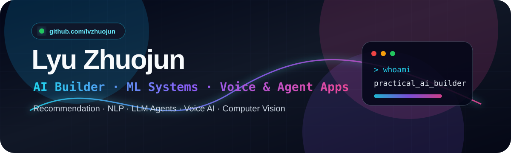
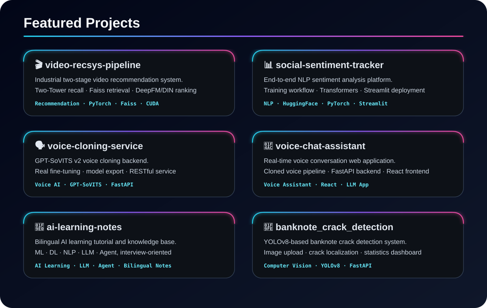

<p align="center">
  
</p>

<p align="center">
  
</p>

<p align="center">
  <a href="https://github.com/lvzhuojun"></a>
  
</p>


## 👾 About Me

```txt
> whoami
Lyu Zhuojun — AI application developer focused on practical systems.

> current_focus
LLM Agents | Recommendation Systems | NLP | Voice AI | Computer Vision

> tech_stack
Python | PyTorch | FastAPI | Streamlit | React | Java | Kotlin | Docker

> mission
Turning AI concepts into runnable, deployable, learning-oriented projects.
```

- 🤖 Exploring **LLM agents, recommendation systems, NLP, voice AI, and computer vision**
- 🧠 Turning AI concepts into runnable systems, from tutorials to deployed demos
- 🛠️ Building with **Python, PyTorch, FastAPI, Streamlit, React, Java, Kotlin**, and full-stack prototypes
- 📚 Maintaining bilingual AI learning notes across **ML · DL · NLP · LLM · Agent**


## ⚡ Tech Stack

<p align="center">
  
  
  
  
  
  
  
  
  
  
</p>


## 🚀 Featured Projects

<p align="center">
  
</p>

### Project map

| Area | Project | Why it matters |
|---|---|---|
| 🎬 Recommender Systems | [video-recsys-pipeline](https://github.com/lvzhuojun/video-recsys-pipeline) | Two-stage video recommendation pipeline with Two-Tower recall, Faiss retrieval, and DeepFM/DIN ranking |
| 📊 NLP | [social-sentiment-tracker](https://github.com/lvzhuojun/social-sentiment-tracker) | End-to-end sentiment analysis workflow with training, evaluation, and Streamlit deployment |
| 🗣️ Voice AI | [voice-cloning-service](https://github.com/lvzhuojun/voice-cloning-service) | GPT-SoVITS fine-tuning backend for personal voice model generation |
| 💬 Voice Assistant | [voice-chat-assistant](https://github.com/lvzhuojun/voice-chat-assistant) | Real-time voice conversation app connecting cloned voices with a web UI |
| 🧠 AI Learning | [ai-learning-notes](https://github.com/lvzhuojun/ai-learning-notes) | Bilingual ML/DL/NLP/LLM/Agent tutorial and interview-oriented knowledge base |
| 🧾 Computer Vision | [banknote_crack_detection](https://github.com/lvzhuojun/banknote_crack_detection) | YOLOv8-based banknote crack detection system with FastAPI and visual results |


## 📊 GitHub Analytics

<p align="center">
  
</p>


## 🌌 Current Focus

```text
AI Systems        ███████████████████░  95%
LLM / Agents      ██████████████████░░  90%
NLP & Recsys      █████████████████░░░  85%
Voice AI          ████████████████░░░░  80%
Full-stack Apps   ██████████████░░░░░░  70%
```

<p align="center">
  <b>Let's build useful AI systems, not just fancy demos.</b>
</p>
