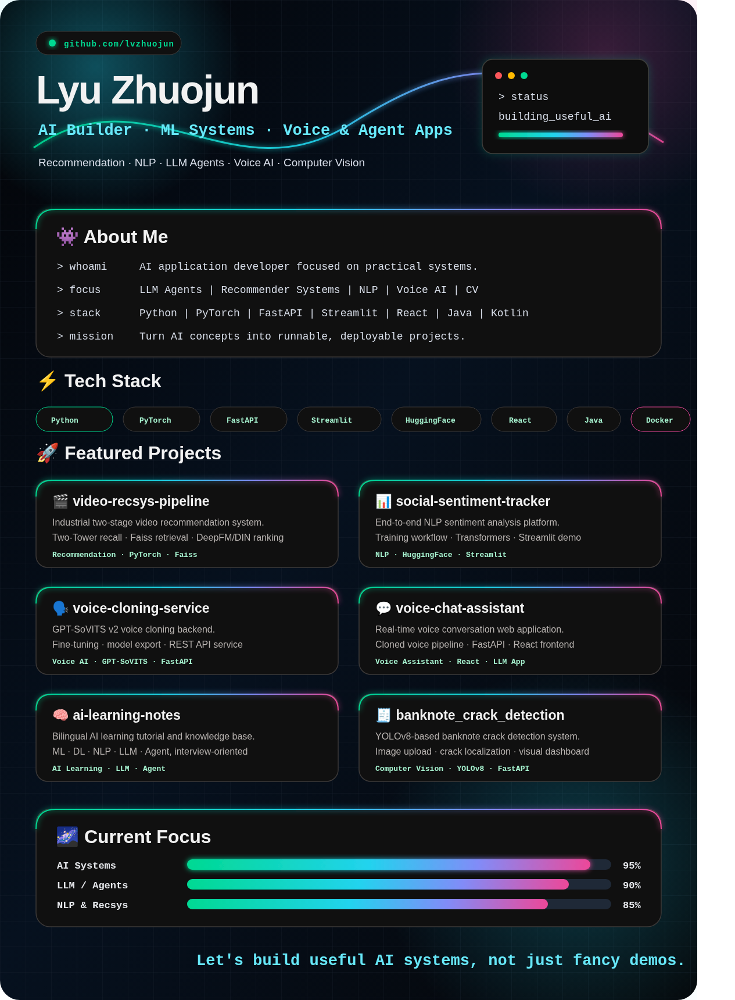

  

  <a href="https://lvzhuojun.github.io/lvzhuojun/"><b>⚡ Launch Interactive Portfolio</b></a>
  ·
  <a href="./docs/index.html">View source page</a>

<!--
  Cyber Night profile README.
  GitHub README cannot change the outer page background, so the main design is rendered
  as one dark image canvas. The editable source is assets/cyber-profile.svg; the PNG is
  used in README because GitHub image sanitization can make complex SVG unreliable.
-->

  <a href="https://github.com/lvzhuojun/video-recsys-pipeline">🎬 video-recsys-pipeline</a> ·
  <a href="https://github.com/lvzhuojun/social-sentiment-tracker">📊 social-sentiment-tracker</a> ·
  <a href="https://github.com/lvzhuojun/voice-cloning-service">🗣️ voice-cloning-service</a> ·
  <a href="https://github.com/lvzhuojun/voice-chat-assistant">💬 voice-chat-assistant</a> ·
  <a href="https://github.com/lvzhuojun/ai-learning-notes">🧠 ai-learning-notes</a> ·
  <a href="https://github.com/lvzhuojun/banknote_crack_detection">🧾 banknote_crack_detection</a>

  
  
  
  
  
  

